<h1 align="center"><b>Hi there, I'm Amir Barari 👋</b></h1>

  

 

## 👨‍💻 About Me

Frontend Engineer focused on Angular ecosystems and cross-platform applications. 

I have contributed to enterprise software, large-scale government automation systems, and graph analytics platforms. My core focus is on building scalable frontend architectures, implementing reactive state management, and ensuring software quality through modular design.

- 📫 **Reach me at:** [amirmohammadbarari415@gmail.com](mailto:amirmohammadbarari415@gmail.com)
- 🔗 **LinkedIn:** [linkedin.com/in/amirmohammad-barari](https://www.linkedin.com/in/amirmohammad-barari/)

 

## ⭐ Featured Projects

### 📱 Well Vibe | *Cross-Platform Psychological Assessment App*
An end-to-end mobile and PWA solution designed for standard-compliant psychological testing and data collection.
- **Tech Stack:** Angular (v21), Ionic, Capacitor, NgRx SignalStore, Strapi
- **Highlights:** 
  - Implemented complex reactive state management without heavy boilerplate using SignalStore.
  - Built offline-first capabilities and seamless data caching strategies.
  - Handled complete cross-platform deployment pipelines.

### 🏢 Government Tax Automation System | *Enterprise Web App*
A large-scale automation platform developed for a governmental Tax Office to handle complex workflows and data processing.
- **Tech Stack:** Angular, NgZorro, RxJS, Docker
- **Highlights:**
  - Designed highly dynamic, data-heavy forms and tables capable of rendering large datasets efficiently.
  - Implemented strict role-based access control (RBAC) and enterprise-level security flows.

### 🕸️ LAP | *Graph Analytics Platform*
A B2B platform focused on detecting financial fraud through complex graph visualizations.
- **Tech Stack:** Angular, Ogma (Linkurious), RxJS
- **Highlights:**
  - Engineered the frontend to render and interact with large-scale graph nodes without performance degradation.
  - Translated complex data science requirements into intuitive user interfaces.

 

## 🛠️ Technical Arsenal

- **Core Ecosystem:** `Angular`, `TypeScript`, `RxJS`
- **Cross-Platform:** `Ionic`, `Capacitor`
- **State Management:** `NgRx`, `SignalStore`, `ComponentStore`
- **UI & Styling:** `HTML5/CSS3/SCSS`, `NgZorro`, `PrimeNG`
- **Testing & Tools:** `Jasmine`, `Docker`, `Git`, `WebStorm`, `Figma`

 

## 📝 Technical Notes & Architecture (Coming Soon)
*Exploring solutions for complex frontend challenges:*
- *State Management patterns with NgRx SignalStore in large apps.*
- *Strategies for handling offline capabilities in cross-platform Angular apps.*
- *Architecting modular Angular applications for enterprise teams.*

 

---

## 📊 GitHub Activity

  

